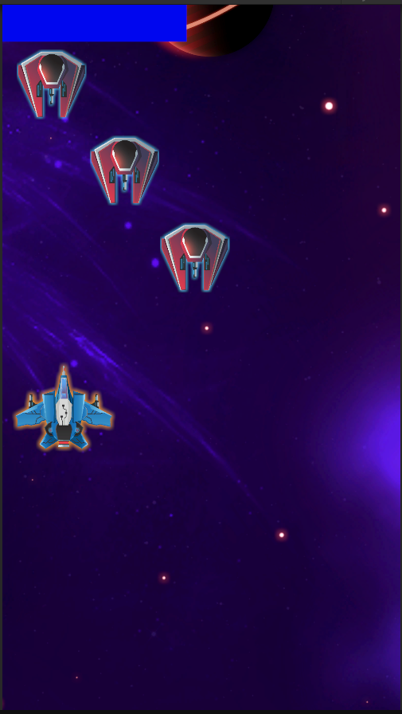
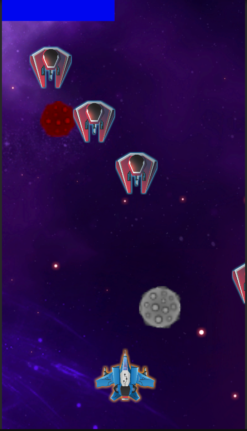

# 🌌 Space Shooter Beta

**Space Shooter Beta**, modern Unity mimarisi kullanılarak geliştirilmiş, dikey eksende ilerleyen arcade tarzı bir uzay savaşı oyunudur.

---

## 🎮 Proje Görünümü

| Aksiyon Anı | Meteor Engelleri |
| :---: | :---: |
|  |  |

---

## 🚀 Öne Çıkan Teknik Özellikler

### 🏗️ Yazılım Mimarisi
* **Singleton Pattern:** `PlayerHealth` ve `UI Manager` sistemlerinde merkezi erişim.
* **Event-Based UI:** Can barı güncellemeleri sadece hasar anında tetiklenir.
* **Modern Input:** Unity Input System entegrasyonu.

### ⚡ Performans
* **Unity.Mathematics:** `math.clamp` ile optimize hesaplamalar.
* **Object Lifecycle:** `OnBecameInvisible` ile bellek yönetimi.

---

